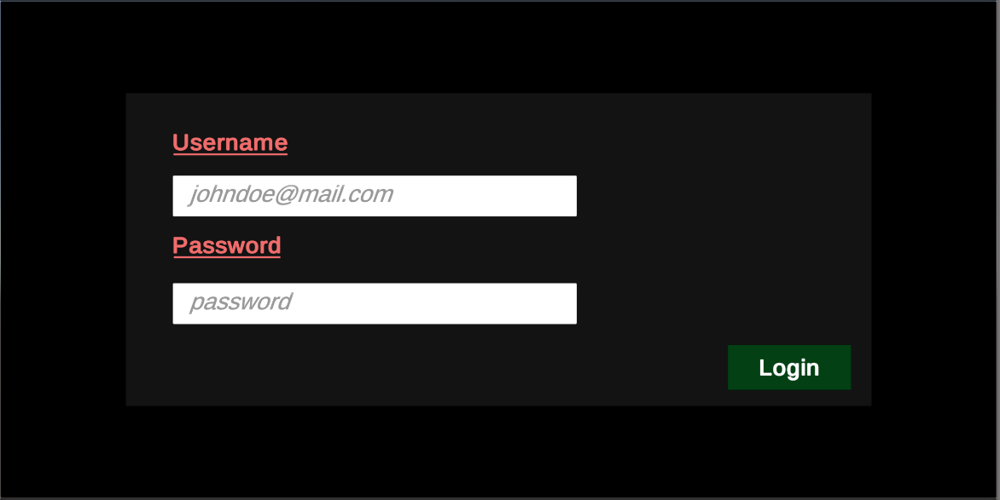
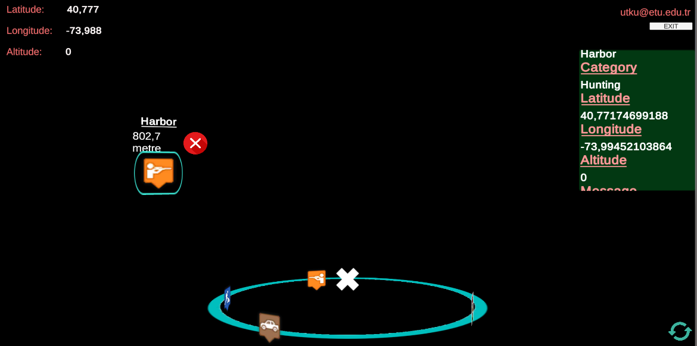
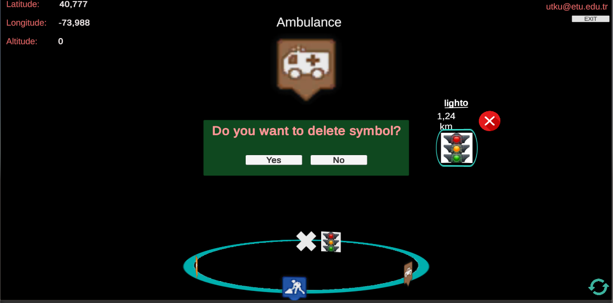
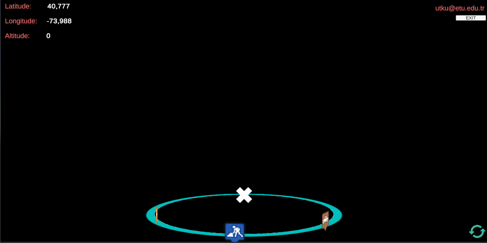

# Location_Based_AR_User
In this project main purpose is adding and removing symbols according to the latitude and longitude of the AR glass, as well as to be able to see symbol additions and deletions made by the administrator, on the mini-map and on the real view.

### Dependencies
This application build with Unity 2018.4.8. For connection between LocationBased_AR_User and LocationBaed_AR_Admin Amazon Web Services has been used. For a dummy user you can login with:

**username:** utku@etu.edu.tr 

**password:** dasddasdf

**Application can be tested in Unity environment or Moverio BT-350 glass.**

### Capabilities

- As a user, you can login with an email and password.

- As a user, you can see your current location top-left corner in the screen.

- As a user, you can add a symbol in your viewing direction and you can arrange the distance of this symbol.

- As a user, you can delete a symbol assigned by you or assigned to you.

- As a user, by clicking a symbol you can see details of this symbol.

- As a user, you can see symbols assigned by you or assigned to you on the mini-map also on the real view. And the location of this symbols changes with the gyroscope data of the AR glass.

